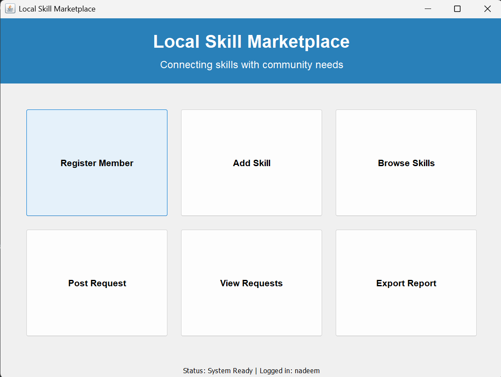

# 🛠️ Local Skill Marketplace

A fully functional, object-oriented **desktop application** built with **Java Swing** and **MySQL**. Serves as a hyper-local digital directory — connecting community members who need everyday services (tutoring, repairs, design) with local talent.

[]()
[]()
[]()
[]()

> **Team project (2 members):** I built the **backend and database layer** (authentication, smart matching algorithm, MySQL schema, CRUD operations, CSV export). My teammate built the **GUI** (Java Swing screens).

---

## ✨ Features

- 🔐 **Secure Authentication** — User registration and login with **SHA-256 password hashing**
- 🧠 **Smart Matching Algorithm** — NLP-style recommendation engine that scans community requests and instantly matches them with relevant skill providers based on keyword analysis
- 🗄️ **Full CRUD** — Create, Read, Update, Delete operations on a MySQL database via JDBC
- 🎨 **Dynamic GUI** — Modern multi-screen interface built with Java Swing and system-native Look & Feel
- 📤 **Data Export** — Exports current database state to `.csv` for future machine learning analysis

---

## 💻 Tech Stack

| Layer | Technology |
|---|---|
| Language | Java (JDK 17+) |
| GUI Framework | Java Swing |
| Database | MySQL |
| DB Driver | JDBC (mysql-connector-j) |
| Architecture | Object-Oriented (MVC-inspired) |

---

## 📸 Application Gallery

### 🔐 Authentication & Dashboard

<p align="center">
  
  
</p>

<p align="center">
  
</p>

### 🗂️ Managing the Marketplace

<p align="center">
  
  
</p>

<p align="center">
  
</p>

### 🧠 Smart Matcher in Action

<p align="center">
  
</p>

<p align="center">
  
</p>

---

## 📂 Project Structure

```
Local-Skill-Marketplace/
│
├── src/
│   ├── Main.java
│   ├── SkillMarketplaceApp.java
│   ├── DatabaseManager.java
│   ├── SecurityHelper.java
│   ├── RecommendationEngine.java
│   ├── FileExporter.java
│   │
│   ├── LoginScreen.java
│   ├── CreateAccountScreen.java
│   ├── ForgotPasswordScreen.java
│   ├── DashboardScreen.java
│   │
│   ├── AddSkillScreen.java
│   ├── BrowseSkillsScreen.java
│   ├── RegisterMemberScreen.java
│   ├── RegisterAccountScreen.java
│   ├── PostRequestScreen.java
│   ├── ViewRequestsScreen.java
│   ├── ExportReportScreen.java
│   │
│   ├── Person.java
│   ├── Skill.java
│   └── ServiceRequest.java
│
├── sql/
│   └── setup.sql
│
├── lib/
│   └── mysql-connector-j-9.7.0.jar
│
├── reports/
│   └── (generated CSV exports)
│
├── images/
│   └── (application screenshots)
│
├── .gitignore
└── README.md
```

---

## ⚙️ How to Run

**1. Clone the repository**

```bash
git clone https://github.com/NADEEMAHMED770/Local-Skill-Marketplace.git
cd Local-Skill-Marketplace
```

**2. Set up the database**

Open MySQL Workbench and run:
```sql
source sql/setup.sql
```

**3. Verify the JDBC driver**

Make sure `mysql-connector-j-9.7.0.jar` is in the `lib/` folder.

**4. Compile**

```bash
javac -cp "lib/mysql-connector-j-9.7.0.jar" -d out src/*.java
```

**5. Run**

```bash
java -cp "out;lib/mysql-connector-j-9.7.0.jar" Main
```

> ⚠️ On Windows, the classpath separator is `;`. On macOS/Linux, use `:` instead.

---

## 🧠 Technical Highlights

### SHA-256 Password Hashing

Passwords are never stored in plain text. On registration, the password is hashed with SHA-256 and only the hash is stored. On login, the entered password is hashed and compared against the stored hash.

### Smart Matching Algorithm

The recommendation engine scans incoming service requests for keywords and compares them against the skill tags registered by members. Providers whose skills match the request keywords are surfaced as recommended matches.

### CSV Export for Data Science

The export feature dumps the current database state (members, skills, requests) into CSV files — laying the foundation for future ML analysis on marketplace trends.

---

## 🚀 Future Improvements

- Migrate from Swing to a web frontend (Flask/React)
- Add bcrypt hashing (stronger than SHA-256 for passwords)
- REST API layer for mobile access
- Email notifications on match
- Analytics dashboard on top of exported CSVs
- Unit tests for the recommendation engine

---

## 🤝 Acknowledgements

Built as an **academic project for the BS Artificial Intelligence program** at Aror University, demonstrating object-oriented programming, database design, and file handling.

**Team of 2:**
- **Backend + Database** — Nadeem Ahmed Ghoto (me)
- **GUI (Java Swing)** — teammate

---

## 📬 Contact

**Nadeem Ahmed Ghoto**
BS Artificial Intelligence Student | Aspiring AI/ML Engineer

- GitHub: [@NADEEMAHMED770](https://github.com/NADEEMAHMED770)
- LinkedIn: [Nadeem Ahmed](https://www.linkedin.com/in/nadeem-ahmed-15033a328/)
- Kaggle: [nadeemahmedghoto](https://www.kaggle.com/nadeemahmedghoto)
